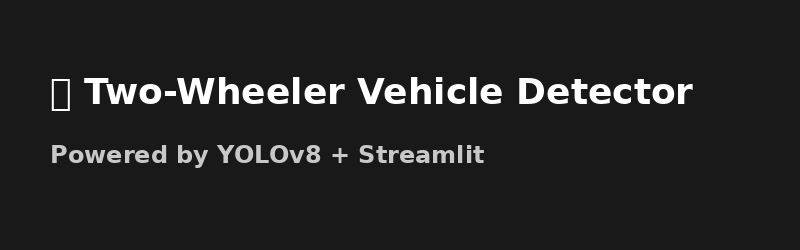

# 🛵 Two-Wheeler Vehicle Detection using YOLOv8

A Streamlit web app that detects motorcycles, scooters, and other two-wheelers using a custom-trained YOLOv8 model.

## 🚀 Features
- Upload image or capture from webcam
- Detect vehicles in real-time with YOLOv8
- View results with bounding boxes
- Download the output image

## 🧠 Powered By
- [Ultralytics YOLOv8](https://github.com/ultralytics/ultralytics)
- [Streamlit](https://streamlit.io/)
- [Hugging Face Space](https://huggingface.co/spaces/azeemaslam/vehicle-detector)

## 💡 Use Cases
- Smart traffic monitoring
- Helmet detection (future)
- Urban mobility analytics

## 📦 Installation
```bash
pip install -r requirements.txt
streamlit run app.py
```

## 📸 Demo Screenshot



## 🛵 Two-Wheeler Detection App

🚗 Detect motorcycles, scooters, and bikes in images or webcam captures using a custom-trained YOLOv8 model.

- Built with **YOLOv8** by Ultralytics
- Interactive frontend using **Streamlit**
- Hosted live on [Hugging Face Spaces](https://huggingface.co/spaces/azeemaslam/vehicle-detector)

[](https://huggingface.co/spaces/azeemaslam/vehicle-detector)
[](https://github.com/azeemaslam/yolov8-two-wheeler-detector)


